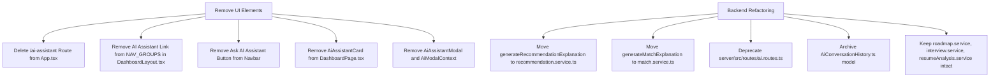
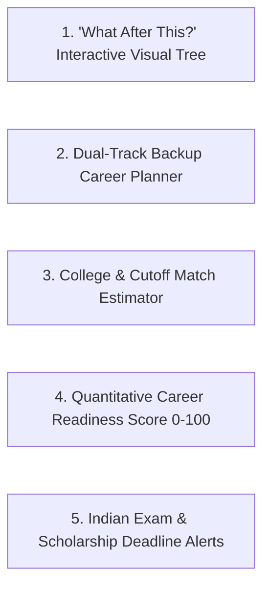
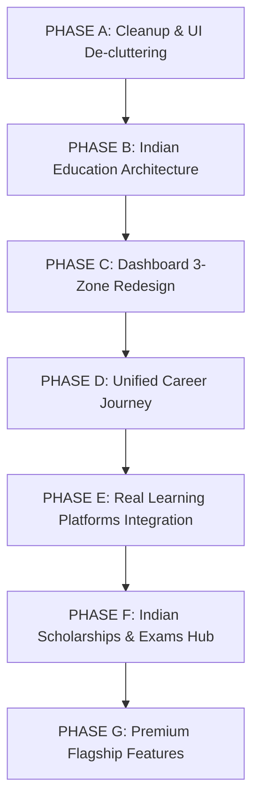

# Visionix — Improvements & Suggestions

---

## 1. Executive Summary

**Visionix** is an ambitious, full-stack career guidance and roadmap platform designed to empower students and professionals to discover, plan, and execute their career aspirations. The platform currently has strong foundational building blocks: a modern React 19 + TypeScript frontend with smooth Framer Motion animations, a clean dark glassmorphic design system, a modular Express + TypeScript backend, robust JWT authentication, multi-step onboarding, and AI integrations powered by Google Gemini.

However, an exhaustive audit of the actual codebase reveals key architectural, UX, educational, and feature-density friction points that prevent Visionix from reaching its full potential as a premier platform for Indian students:

1. **Dashboard Cognitive Overload**: The dashboard currently renders up to 10+ widgets simultaneously across multiple rows and columns, mixing high-priority actionable items with unpopulated or mock placeholder cards (Scholarships, Upcoming Exams, Continue Learning).
2. **Indian Education Flow Alignment**: The existing education options combine global degree terminology with Indian structures, creating friction. Indian students need a clear, intuitive hierarchy tailored to School (Classes 6–10), Intermediate / +2 / PUC (MPC, BiPC, Commerce, Arts), Polytechnic Diplomas, and Indian Undergraduate Degree pathways.
3. **AI Assistant Disconnect**: The standalone AI Assistant chatbot acts as a generic conversational wrapper, while the platform's true value lies in *contextual* AI (automated roadmap generation, skill-gap analysis, mock interview evaluation, and resume auditing). Removing or repositioning the generic chatbot will sharpen the platform's core identity.
4. **Authentication & Password Friction**: The password creation screen features an overly strict, confusing 5-tier password strength bar ("Very Weak" to "Very Strong") that creates anxiety and friction for young students.
5. **Feature Fragmentation in Career & Learning**: Career Explorer, Career Recommendations, Career Match, and Career Roadmaps currently feel like loosely connected tools rather than a single unified student journey. Similarly, Learning Hub relies exclusively on YouTube search queries without structured, recognized Indian education courses (SWAYAM, NPTEL, Skill India).
6. **Missing Indian Scholarship & Entrance Exam Engines**: While widgets exist on the dashboard, there are no dedicated backend schemas, databases, or tracking pages for real Indian scholarships (NSP, state portals) or competitive entrance exams (JEE, NEET, CUET, GATE, UPSC, CLAT).

This document delivers a comprehensive, screen-by-screen, architectural analysis of Visionix and provides an actionable, prioritized roadmap for refinement.

---

## 2. Video Analysis

> [!NOTE]
> **Reference Video Status**: The user indicated that a reference video could not be provided for this session (`"check on your own i can't provide reference video"`). In strict accordance with the instructions (*"If you cannot access/read the video, explicitly state that in the markdown file instead of pretending to analyze it"*), this analysis does not fabricate or assume external video content. Instead, an exhaustive visual, interaction, and architectural audit of the active Visionix codebase, design tokens, layout primitives, and component trees was performed.

### Key Visual & Interaction Audit of Visionix's Current System:

| Visual Element | Current State in Visionix | What Works Well | What Feels Weak / Clumsy | Recommended Approach | Benefit to Students |
|---|---|---|---|---|---|
| **Design System & Palette** | Dark glassmorphism (`--bg-dark: #090d16`, `--bg-card: rgba(18, 26, 43, 0.7)`, vibrant purple/indigo accents `#6366f1`, `#8b5cf6`, `#10b981`). | Sleek, modern, feels high-tech and visually engaging for tech-savvy users. | High contrast borders and multiple background blur layers can cause visual noise and lag on low-end mobile devices. | Maintain dark mode as default but introduce curated contrast tiers and accessible light/dim themes. | Reduces eye fatigue and ensures smooth rendering on entry-level mobile devices. |
| **Typography & Hierarchy** | System font stack (`system-ui, -apple-system, Inter, Roboto, sans-serif`) with font sizes from `0.65rem` to `2.5rem`. | Clean font rendering, good responsive scaling on headings. | Overuse of ultra-small captions (`0.65rem` / `10px`) in dashboard cards and scholarship widgets makes critical text hard to read. | Standardize minimum body text to `0.875rem` (14px) and captions to `0.75rem` (12px). | Improves readability for school students using mobile phones with varied screen resolutions. |
| **Dashboard Grid Structure** | 12-column master grid (`colSpan9` + `colSpan3`) followed by a 3-column lower grid (6 cards). | High information density on large 1440p+ desktop displays. | Overwhelms the viewport. On standard laptops (1366x768) and mobile, cards stack into an endless 4000px+ vertical scroll. | Transition to a **3-Zone Focused Dashboard**: (1) Today's Action & Target Career, (2) Active Learning & Milestone Progress, (3) Deadlines & Opportunities. | Provides immediate clarity: the student instantly knows what to do next without scrolling endlessly. |
| **Navigation & Sidebar** | Left fixed sidebar with 15 navigation links across 3 groups + bottom "Upgrade/Free Hub" card. | Smooth Framer Motion `layoutId` active pill indicator, responsive drawer. | 15 links creates decision paralysis. Bottom upgrade card says "100% Free" with an "Upgrade" visual style, which is confusing. | Group navigation into 4 primary hubs: **Dashboard**, **Career Paths & Roadmap**, **Learning & Exams**, and **Tools & Profile**. | Drastically reduces cognitive load and keeps primary features accessible in 1 click. |
| **Top Navbar Search** | Search bar with `⌘K` badge, voice search mic icon, and animated dropdown containing static suggestions. | High visual polish and modern styling. | Search suggestions are hardcoded in JSX; voice search is non-functional; `⌘K` badge is irrelevant on mobile touchscreens. | Implement real instant search querying careers, skills, courses, and exams with active debouncing. | Students can quickly find any career, degree, or exam instantly from any page. |

---

## 3. Current Visionix Audit

A comprehensive module-by-module audit of the active codebase:

### 3.1. Landing Page (`src/pages/LandingPage.tsx`)
- **Current State**: Features a sticky navbar, gradient hero with glowing canvas lights, interactive simulated career preview widget (`PreviewWidget.tsx`), 6 bento grid feature showcases, student testimonials, and footer.
- **What is Good**: Visually stunning first impression; smooth scroll and hover animations; clear branding.
- **What is Incomplete / Clumsy**:
  - The `PreviewWidget.tsx` contains static hardcoded sample data (`Frontend Engineer`, `Data Scientist`, `Product Designer`) that is disconnected from the backend database.
  - Some landing page CTAs route directly to `/onboarding`, which triggers an authentication redirect to `/login` for guest users, creating a disjointed first-time experience.
- **Recommendation**:
  - Update all public landing page CTAs to route to `/signup`.
  - Connect the interactive preview widget to real career taxonomy data so visitors can sample real pathways before signing up.

### 3.2. Authentication (`src/pages/LoginPage.tsx`, `src/pages/SignupPage.tsx`)
- **Current State**: Email/password forms with client-side regex validation, password visibility toggle, accessible aria labels, and JWT session persistence.
- **What is Good**: Fast form feedback, automatic error clearance on keystroke, clear error banners.
- **What is Incomplete / Clumsy**:
  - Signup page displays a 5-tier password strength bar (`Very Weak`, `Weak`, `Medium`, `Strong`, `Very Strong`) that flags valid passwords as "Weak" or "Medium" if symbols are omitted.
  - Full Name validation rejects single names or standard Indian naming conventions (e.g. initials with spaces).
- **Recommendation**: Replace the subjective strength bar with simple, clear requirement checks (see Section 5).

### 3.3. AI Onboarding (`src/pages/OnboardingPage.tsx`, `AboutYouStep.tsx`, `AboutEducationStep.tsx`, `AboutCareerStep.tsx`)
- **Current State**: 3-step wizard:
  - Step 1 (*About You*): First Name (Req), Last Name (Req), Date of Birth (Req, future dates blocked), Gender, Location.
  - Step 2 (*Education*): Education Level (Req), School Class (Req if School) vs Degree/Year (Req if Higher Ed), Multiple Courses management (`+ Add Course`), Specialization (Opt).
  - Step 3 (*Career Goals*): Dream Career (Optional), Target Industry (Req), Primary Career Objectives (Req).
- **What is Good**: High data integrity; backward-compatible `fullName` derivation; strict client and server validation; fast multi-course entry.
- **What is Incomplete / Clumsy**:
  - Step 3 requires "Target Industry" and "Career Objectives" even when a young School student (Class 6–10) has no clear career concept yet.
  - Taxonomy dropdowns show long lists without contextual filtering based on the student's age or grade level.
- **Recommendation**:
  - If "School (Class 6–10)" is selected, simplify Step 3 to "What subjects or activities do you enjoy most?" rather than corporate industry checkboxes.

### 3.4. User Dashboard (`src/pages/DashboardPage.tsx`)
- **Current State**: Renders Welcome Banner, Stats Grid (4 cards), AI Assistant Card, Recommended Career Card, Roadmap Progress Card, Continue Learning, Recommended Skills, Trending Careers, YouTube Learning, Scholarships, and Upcoming Exams.
- **What is Good**: Complete dynamic data wiring to `PersonalizationService`; graceful fallback handling; memoized sub-widgets.
- **What is Incomplete / Clumsy**:
  - **10 widgets crammed on one page**: High visual fatigue.
  - **Empty/Unpopulated widgets**: Scholarships, Upcoming Exams, and Continue Learning often render empty state boxes because their backend models are not yet populated with structured databases.
- **Recommendation**: Restructure the dashboard into 3 clean, prioritized zones (see Section 7).

### 3.5. Career Explorer, Recommendation & Match (`src/pages/CareerExplorerPage.tsx`)
- **Current State**: Displays a catalog of 30+ careers filtered by 16 categories, search bar, toggle for "AI Recommendations", toggle for "Career Match %", side-by-side comparison modal (up to 3 careers), and career detail drawer (`CareerDetailsModal.tsx`).
- **What is Good**: Fast category filtering, rich modal details (salary, skills, education pathways, typical day).
- **What is Incomplete / Clumsy**:
  - "Career Explorer", "Career Recommendations", and "Career Match" are jammed into toggle buttons on the same page, confusing users on whether they are browsing all careers or personalized suggestions.
  - The comparison modal only compares basic text fields without graphical skill overlap or difficulty breakdown.
- **Recommendation**: Unify discovery into a guided workflow: Explore by Education Level -> Filter by Interests -> Compare Top 3 -> Select Target Path (see Section 8).

### 3.6. Career Roadmap (`src/pages/CareerRoadmapPage.tsx`)
- **Current State**: Visual timeline displaying sequential milestones (Phases 1 to 4+), active milestone detail drawer, status transitions (`locked`, `active`, `completed`), AI roadmap regeneration, milestone verification quizzes, and related YouTube resources.
- **What is Good**: Highly comprehensive milestone tracking; direct linkage to skill quizzes; ability to switch active careers from saved bookmarks.
- **What is Incomplete / Clumsy**:
  - Long roadmaps feel daunting. A 10th-class student seeing a 4-year multi-phase roadmap with corporate engineering terms gets overwhelmed.
  - Overwriting an active roadmap with AI regeneration does not provide a preview diff of changes.
- **Recommendation**: Provide a "Stage View" (e.g. "School Stage", "College Stage", "First Job Stage") so students only focus on milestones relevant to their immediate next 6–12 months.

### 3.7. Learning Hub & YouTube Learning (`src/pages/LearningHubPage.tsx`, `YouTubeLearningPage.tsx`)
- **Current State**: Curates YouTube videos based on career and skill keywords, tracks completed video resources, and supports bookmarking.
- **What is Good**: Real video player embeds, progress state persistence in `LearningProgress` model.
- **What is Incomplete / Clumsy**:
  - Relies solely on YouTube video searches, which can include outdated tutorials, clickbait, or unverified channels.
  - Lacks structured courses from accredited Indian and global learning platforms (SWAYAM, NPTEL, Skill India, Coursera).
- **Recommendation**: Integrate verified learning course catalogs from government and open-education providers (see Section 9).

### 3.8. Skill Navigator & Gap Analysis (`src/pages/SkillNavigatorPage.tsx`)
- **Current State**: Evaluates user's reported skills against target career requirements, renders missing skill tags, priority badges, and an embedded AI Skill Coach chat.
- **What is Good**: Clear visual breakdown of "Target Skills" vs "Missing Skills"; actionable recommendations.
- **What is Incomplete / Clumsy**: AI Skill Coach is another standalone chat widget that duplicates functionality of the AI Assistant.
- **Recommendation**: Convert the Skill Coach chat into concrete action cards: "To learn Python: [Recommended NPTEL Module] -> [Take Skill Assessment Quiz]".

### 3.9. Resume Builder & Mock Interview (`src/pages/ResumeBuilderPage.tsx`, `InterviewPage.tsx`)
- **Current State**: Full multi-section resume builder with real-time preview, ATS scoring, and AI suggestions. Interactive mock interview simulator with role-specific questions, user answer submissions, and AI evaluation scores.
- **What is Good**: Outstanding depth for college students and job seekers.
- **What is Incomplete / Clumsy**:
  - Both tools are visible to School students (Classes 6–10) in the sidebar, where they are irrelevant and create clutter.
- **Recommendation**: Dynamically show or hide these tools based on the user's educational stage (College / Graduate vs School).

### 3.10. Business & Startup Hub (`src/pages/BusinessPage.tsx`)
- **Current State**: Startup idea evaluator, business model canvas builder, and startup roadmap generator.
- **What is Good**: Great niche utility for aspiring entrepreneurs.
- **What is Incomplete / Clumsy**: Placed prominently in the primary sidebar navigation, distracting school/college students seeking core academic guidance.
- **Recommendation**: Move to an "Advanced Pathways" or "Entrepreneurship" sub-section.

---

## 4. AI Assistant Review

### 4.1. Audit of the Current AI Assistant Implementation

The existing codebase contains two types of AI functionality:
1. **The Standalone Conversational Chatbot**:
   - Frontend Page: `src/pages/AiAssistantPage.tsx`
   - Frontend Modal: `src/components/ai/AiAssistantModal.tsx` & `AiModalContext.tsx`
   - Dashboard Card: `src/components/dashboard/AiAssistantCard.tsx`
   - Sidebar & Navbar Buttons: `Ask AI Assistant ✨` in `DashboardLayout.tsx`
   - Backend Route & Controller: `server/src/routes/ai.routes.ts`, `server/src/controllers/ai.controller.ts`
   - Backend Database Model: `server/src/models/AiConversationHistory.ts`
   - Backend Chat Methods: `AiService.processChatMessage`, `getChatHistory`, `clearChatHistory`, `deleteChatSession`
2. **Contextual & Feature-Specific AI Engines**:
   - `roadmap.service.ts`: Generates custom career milestones and timelines.
   - `interview.service.ts`: Generates mock interview questions and scores answers.
   - `resumeAnalysis.service.ts`: Audits resume text and provides ATS keyword gaps.
   - `career.controller.ts`: Calls `AiService.generateRecommendationExplanation` and `generateMatchExplanation`.
   - `skillNavigator.service.ts`: Generates skill gap action plans.

### 4.2. Analysis: Should the Standalone AI Assistant Be Removed?

**Recommendation**: **YES — Remove the Standalone AI Assistant Page and Floating Chatbot, while Preserving Contextual AI Features.**

#### Detailed Rationale:
1. **Reduces "AI Wrapper" Perception**: Generic chatbots are everywhere. Having an open-ended chatbot makes Visionix look like a ChatGPT wrapper, diluting its value as an authoritative, structured career architecture platform.
2. **Eliminates UI Clutter**: Removing the chatbot eliminates:
   - Floating modal across all pages.
   - "Ask AI Assistant" header button in navbar.
   - Dedicated `/ai-assistant` sidebar tab.
   - `AiAssistantCard.tsx` widget on the dashboard.
3. **Contextual AI is Far More Powerful**: Students don't want to chat aimlessly; they want specific answers at specific moments:
   - When viewing a career: *"Why is this recommended for me?"* (Contextual explanation pill).
   - When viewing a roadmap: *"Generate tailored milestones for 2nd year B.Tech"* (Roadmap AI).
   - When practicing: *"Evaluate my interview answer"* (Mock Interview AI).

#### Safe Removal & Cleanup Plan:


---

## 5. Authentication / Password UX

### 5.1. Current Password Implementation Audit
- **Validation Rules** (`src/utils/validation.ts` & `auth.validator.ts`):
  - Minimum 8 characters
  - At least 1 uppercase letter (`[A-Z]`)
  - At least 1 lowercase letter (`[a-z]`)
  - At least 1 number (`[0-9]`)
- **Strength Meter** (`getPasswordStrength` in `validation.ts`):
  - Calculates score 0–5 based on length, uppercase, lowercase, number, and special characters (`[^A-Za-z0-9]`).
  - Returns: `very-weak`, `weak`, `medium`, `strong`, `very-strong`.
  - Renders a multi-colored bar (Red -> Orange -> Yellow -> Green -> Emerald) with text label *"Strength: Medium"*.

### 5.2. Problems with Current UI
1. **Frustrates Young Students**: A student who enters `Password123` meets all valid submission requirements, yet the strength meter shows yellow/orange with "Medium" or "Weak", creating anxiety that their form will be rejected.
2. **Ambiguous Criteria**: The user is not told *why* their password is "Weak" or what specific action will make it acceptable.
3. **Layout Shift**: Error messages below inputs push other form elements down dynamically, causing jitter on mobile keyboards.

### 5.3. Recommended Student-Friendly Alternative
- **Rule**: Minimum 8 characters, containing letters and at least one number.
- **UI Design**: Remove the ambiguous 5-color bar completely. Replace it with an inline **Live Requirements Checklist** that turns green as criteria are fulfilled:
  ```
  Password [ •••••••• ] [👁️]
  ✓ At least 8 characters
  ✓ Contains letters and numbers
  ```
- **Benefit**: Transparent, zero ambiguity, instant positive reinforcement, and effortless completion for school and college students.

---

## 6. Indian Education Architecture

To make Visionix feel authentic and natively designed for Indian students, the educational taxonomy must accurately mirror the Indian academic landscape under the National Education Policy (NEP) and state education boards.

```mermaid
graph TD
  Root[Indian Education Landscape] --> School[School: Classes 6 to 10]
  Root --> Inter[Intermediate / +2 / PUC: Classes 11 & 12]
  Root --> Diploma[Polytechnic / Technical Diploma]
  Root --> UG[Undergraduate / Bachelor Degrees]
  Root --> PG[Postgraduate / Masters & Higher]

  School --> S1[General Curriculum: Science, Maths, Social, Languages]
  School --> S2[Stream Selection & Olympiad Prep]

  Inter --> MPC[Science: MPC / PCM - Engg, Tech, Defense]
  Inter --> BiPC[Science: BiPC / PCB - Med, Pharma, Agri]
  Inter --> PCMB[Science: PCMB - Dual Track]
  Inter --> MEC[Commerce: MEC / CEC - CA, BBA, Finance]
  Inter --> HEC[Arts / Humanities: HEC - Law, Civil Services, Design]

  Diploma --> DipEng[Polytechnic Engg: Mech, Civil, EEE, ECE, CS]
  Diploma --> DipPharm[D.Pharm & Paramedical]
  Diploma --> DipVoc[Vocational & Design Diplomas]

  UG --> BTech[Engineering: B.Tech / B.E.]
  UG --> Med[Medicine & Allied: MBBS, BDS, B.Pharm, Nursing]
  UG --> Comm[Commerce & Mgmt: B.Com, BBA, BMS, CA/CS]
  UG --> Sci[Pure & Applied Sciences: B.Sc, B.Sc Agri, BCA]
  UG --> Law[Legal Studies: 5-Yr Integrated BA/BBA LLB]
  UG --> Des[Design & Media: B.Des, B.Arch, BJMC]
  UG --> Hum[Humanities: B.A. Economics, Psychology, Literature]
```



### 6.1. Comprehensive Stage-by-Stage Breakdown

#### Stage 1: Early School (Nursery to Class 5)
- **Recommendation**: **SKIP detailed tracking**. Visionix should focus on career awareness starting from middle school (Class 6).

#### Stage 2: Middle & High School (Classes 6 to 10)
- **Level**: `School (Classes 6–10)`
- **Class Selection**: `Class 6`, `Class 7`, `Class 8`, `Class 9`, `Class 10`
- **Stream / Course**: *Hidden / Not Required* (Standardized General Curriculum: Mathematics, Science, Social Sciences, English, Regional Language).
- **Visionix Value Proposition for this Stage**:
  - Guidance on *"What stream should I pick after Class 10?"* (Science vs Commerce vs Arts vs Polytechnic).
  - Preparation for NTSE, Junior Science Olympiads, Foundation courses.
  - Early career exploration (discovering what engineers, doctors, designers, and civil servants actually do).

#### Stage 3: Intermediate / Higher Secondary / +2 / Junior College (Classes 11 & 12 / PUC)
- **Level**: `Intermediate / +2 / PUC (Classes 11–12)`
- **Class Selection**: `Class 11 (1st Year)`, `Class 12 (2nd Year)`
- **Indian Stream Combinations (Required)**:
  - **Science (MPC / PCM)**: Mathematics, Physics, Chemistry -> Targets: Engineering (JEE), Architecture, Defense (NDA), Computing, Pure Sciences.
  - **Science (BiPC / PCB)**: Biology, Physics, Chemistry -> Targets: Medicine (NEET), BDS, Pharmacy, Nursing, Biotechnology, Agriculture, Veterinary.
  - **Science (PCMB)**: Physics, Chemistry, Mathematics, Biology -> Dual Pathway (Both JEE and NEET eligible).
  - **Commerce (MEC / CEC)**: Mathematics/Civics, Economics, Commerce -> Targets: CA, CS, B.Com, BBA, Corporate Finance, Actuarial Science.
  - **Humanities / Arts (HEC / HES)**: History, Economics, Civics/Sociology -> Targets: Law (CLAT), Civil Services (UPSC), Journalism, Psychology, Design, Literature.
  - **Vocational Intermediate**: IT, Accounting, Paramedical, Electrical trades.

#### Stage 4: Polytechnic / Diploma Pathways
- **Level**: `Diploma / Polytechnic`
- **Branches**: Mechanical Engineering, Civil Engineering, Electrical & Electronics (EEE), Electronics & Communication (ECE), Computer Engineering, Automobile Engineering, Chemical Engineering, D.Pharm (Pharmacy), Hotel Management, Commercial Art.
- **Study Year**: `1st Year`, `2nd Year`, `3rd Year`, `Completed / Seeking Lateral Entry (LEET/ECET into 2nd year B.Tech)`.

#### Stage 5: Undergraduate Degrees (Bachelor's Degrees in India)
- **Level**: `Undergraduate (Bachelor's Degree)`
- **Major Indian Degree Pathways**:
  - **Engineering & Technology**: B.Tech / B.E. (Computer Science, AI & ML, Data Science, Cyber Security, Electronics & Communication, Electrical, Mechanical, Civil, Biotechnology, Aerospace, Chemical).
  - **Computer Applications & IT**: BCA, B.Sc Computer Science, B.Sc Information Technology.
  - **Medical & Dental**: MBBS (5.5 yrs), BDS (5 yrs), BAMS (Ayurveda), BHMS (Homeopathy), BVSc (Veterinary).
  - **Allied Healthcare & Pharmacy**: B.Pharm (4 yrs), Pharm.D (6 yrs), B.Sc Nursing, BPT (Physiotherapy), B.Sc Medical Lab Technology (MLT), B.Sc Radiology.
  - **Commerce, Business & Management**: B.Com (General, Computers, Honours), BBA, BMS, BBM, CA Foundation / Inter, CMA, CS.
  - **Pure & Applied Sciences**: B.Sc (Physics, Chemistry, Mathematics, Statistics, Biotechnology, Microbiology, B.Sc Agriculture / Horticulture, Food Technology).
  - **Law & Legal Studies**: 5-Year Integrated LLB (BA LLB, BBA LLB, B.Com LLB), 3-Year LLB (Post-degree).
  - **Design, Architecture & Media**: B.Arch (5 yrs), B.Des (Fashion, UI/UX, Product, Graphic), B.Sc Animation & VFX, BA Journalism & Mass Communication (BJMC).
  - **Humanities & Social Sciences**: BA (Economics, Psychology, Political Science, English Literature, Sociology, History).
  - **Hospitality, Aviation & Tourism**: BHM (Hotel Management), B.Sc Culinary Arts, BBA Aviation / Airport Management.
- **Study Year**: `1st Year`, `2nd Year`, `3rd Year`, `4th Year / Final Year`, `5th Year (for 5-yr degrees)`, `Graduated / Seeking Job`.

### 6.2. Field Visibility & Requirement Matrix

| Field | School (6–10) | Intermediate (11–12) | Diploma | Undergraduate | Postgraduate |
|---|---|---|---|---|---|
| **Education Level** | **Required** | **Required** | **Required** | **Required** | **Required** |
| **Current Class / Year** | **Required** (Class 6–10) | **Required** (Class 11–12) | **Required** (Year 1–3) | **Required** (Year 1–Final) | **Required** (Year 1–Final) |
| **Stream / Discipline** | *Hidden* | **Required** (MPC, BiPC, etc.) | **Required** (Branch) | **Required** (B.Tech, B.Com, etc.) | **Required** (M.Tech, MBA, etc.) |
| **Branch / Specialization** | *Hidden* | *Hidden* | *Optional* | *Optional* | *Optional* |
| **School / College Name** | *Optional* | *Optional* | *Optional* | *Optional* | *Optional* |
| **Dream Career** | *Optional* | *Optional* | *Optional* | *Optional* | *Optional* |

---

## 7. Dashboard Improvements

### 7.1. Critical Problems in Current Dashboard
1. **Severe Widget Clutter**: 10 distinct card containers rendered in a single view: Welcome banner, 4-stat metrics, AI assistant card, recommended career hero, roadmap progress card, continue learning card, target skills card, trending careers card, YouTube learning card, scholarships card, upcoming exams card.
2. **No Clear Visual Hierarchy**: Everything screams for attention at the same level of visual intensity.
3. **Empty Placeholder Widgets**: Widgets for Scholarships, Exams, and Continue Learning frequently render empty or mock states.
4. **Poor Mobile Usability**: The desktop 12-column grid collapses into a single endless column requiring over 15 swipes to navigate.

### 7.2. Recommended 3-Zone Dashboard Architecture

The dashboard should answer three questions immediately:
1. *Where am I right now?* (Current Education & Target Career)
2. *What should I do today?* (Immediate Next Action / Milestone)
3. *What opportunities are coming up?* (Upcoming Exam Deadlines & Scholarships)

```
┌────────────────────────────────────────────────────────────────────────────────────────┐
│ ZONE 1: HERO FOCUS (Immediate Status & Next Action)                                   │
├────────────────────────────────────────┬───────────────────────────────────────────────┤
│ Welcome, Rahul!                        │ PRIMARY TARGET CAREER                         │
│ Class 11 — Science (MPC Stream)        │ 🎯 Machine Learning Engineer (94% Fit)         │
│                                        │ [ Switch Career ]   [ View Full Roadmap ]     │
├────────────────────────────────────────┴───────────────────────────────────────────────┤
│ ⚡ YOUR NEXT MILESTONE                                                                 │
│ Milestone 2: Python Foundations & Data Structures — 40% Complete                      │
│ Next Step: Complete Module 3 Assessment Quiz (10 mins)                                 │
│ [ ▶ Continue Learning ]   [ 📝 Take Skill Quiz ]                                       │
└────────────────────────────────────────────────────────────────────────────────────────┘

┌────────────────────────────────────────────────────────────────────────────────────────┐
│ ZONE 2: ACTIVE LEARNING & SKILL PROGRESS                                               │
├────────────────────────────────────────┬───────────────────────────────────────────────┤
│ 📚 ACTIVE LEARNING MODULES             │ 🎯 SKILL READINESS & VERIFICATION             │
│ • Python for Beginners (NPTEL) - 60%   │ • Python: ⭐⭐⭐ Verified                     │
│ • Mathematics for AI (SWAYAM) - 25%    │ • SQL: ⭐ In Progress (Take Quiz)             │
│ [ Explore Learning Hub → ]             │ • Data Structures: ⏳ Up Next                 │
└────────────────────────────────────────┴───────────────────────────────────────────────┘

┌────────────────────────────────────────────────────────────────────────────────────────┐
│ ZONE 3: DEADLINES & OPPORTUNITIES (Tailored to Education Level)                        │
├────────────────────────────────────────┬───────────────────────────────────────────────┤
│ 📅 UPCOMING ENTRANCE EXAMS             │ 🎓 MATCHING SCHOLARSHIPS                      │
│ • JEE Main 2027 Session 1 (In 45 Days) │ • HDFC Badhte Kadam Scholarship (₹30,000/yr)  │
│ • BITSAT 2027 (Registration Open)      │ • NSP Central Sector Scheme (Eligible)        │
│ [ View All Entrance Exams → ]          │ [ Discover All Scholarships → ]               │
└────────────────────────────────────────┴───────────────────────────────────────────────┘
```

---

## 8. Career Experience

### 8.1. Current Fragmentation
Currently, Career Explorer (`/explore`), Career Recommendations (toggle), Career Match (toggle), Career Roadmap (`/roadmap`), Saved Careers (`/saved`), and Skill Gap (`/skill-gap`) are separate, disjointed pages. A student has to guess how to move from discovering a career to planning for it.

### 8.2. Recommended Unified Career Journey
Visionix should guide students through a clear, sequential 6-stage lifecycle:

```
Step 1: DISCOVER
Explore careers filtered by Indian Education Level & Interests (e.g. "Careers after 12th MPC" or "Careers after B.Com").
   ↓
Step 2: COMPARE
Select up to 3 careers and view a side-by-side comparison:
• Educational Path & Duration (e.g. 4 yrs B.Tech vs 5 yrs Integrated)
• Starting Salary vs 5-Year Growth in India
• Competition Level & Entrance Exams
• Difficulty & Skill Curve
   ↓
Step 3: SELECT & BACKUP
Select 1 Primary Target Career + 1 Backup Career (e.g. Primary: AI Engineer, Backup: Full Stack Developer).
   ↓
Step 4: GENERATE ROADMAP
AI generates a stage-by-stage timeline customized to the student's current class/year.
   ↓
Step 5: LEARN & VERIFY
Complete curated course modules and take milestone verification quizzes to earn verified skill badges.
   ↓
Step 6: EXAM & COLLEGE ALIGNMENT
Track entrance exams, college cutoffs, and eligible scholarships needed to enter that career.
```

---

## 9. Learning & Online Courses

### 9.1. Real Educational Sources for Indian Students

Visionix must move beyond raw YouTube searches to integrate and reference verified, accredited learning platforms suitable for Indian students.

| Platform | Provider & Credibility | Target Audience | Cost & Certification | Best Integration Method |
|---|---|---|---|---|
| **SWAYAM** (`swayam.gov.in`) | Ministry of Education, Govt. of India / AICTE | Classes 9–12, UG, PG students | **Free courses**; Optional nominal exam fee (₹1000) for proctored certificate with university credit transfer. | Curated catalog indexed by subject and career stream with direct course links. |
| **NPTEL** (`nptel.ac.in`) | IITs (IIT Madras, Bombay, etc.) & IISc | Engineering, Science, Management, Humanities UG/PG | **Free video lectures & assignments**; Verified IIT certification available. | Deep link to official course playlists and syllabus modules. |
| **Skill India Digital Hub** (`skillindiadigital.gov.in`) | NSDC & Ministry of Skill Development | School dropouts, vocational students, college job seekers | **100% Free Government certifications** in IT, healthcare, telecom, automotive, logistics. | Index government vocational certificate courses mapped to practical trades. |
| **DIKSHA** (`diksha.gov.in`) | NCERT / Ministry of Education | School students (Classes 6–12) | **100% Free** NCERT textbooks, video lessons, and worksheets in 30+ Indian languages. | Direct subject-wise learning links for School students (Class 6–10). |
| **Infosys Springboard** (`springboard.infosys.com`) | Infosys CSR Foundation | Classes 6–12, College students, Freshers | **100% Free** interactive courses on Python, AI, Cloud, Communication, and Professional Skills. | Map Springboard learning tracks to Visionix roadmap milestones. |
| **freeCodeCamp & CS50** | Non-profit / Harvard University | College & Self-Learners | **100% Free verified certifications** in Web Dev, Python, JavaScript, Algorithms. | Directly link specific certification tracks for software & tech roadmaps. |
| **Khan Academy** (`khanacademy.org`) | Non-profit foundation | School & Intermediate (Classes 6–12) | **100% Free** mastery-based math, physics, chemistry, and computing lessons. | Foundational math and science modules for Classes 9–12 (MPC/BiPC). |

---

## 10. Scholarships

### 10.1. Real Indian Scholarship Ecosystem

Visionix should provide an authentic discovery and tracking engine for genuine scholarships available to Indian students across school, intermediate, diploma, and college levels.

| Scholarship Scheme | Authority / Provider | Eligibility Tier | Financial Benefit | Official Application Portal |
|---|---|---|---|---|
| **National Scholarship Portal (NSP) Central Sector Scheme** | Department of Higher Education, Govt. of India | College/University students (>80th percentile in Class 12, family income < ₹4.5 Lakh) | ₹12,000/yr for graduation; ₹20,000/yr for post-graduation | [scholarships.gov.in](https://scholarships.gov.in) |
| **National Means-cum-Merit Scholarship (NMMS)** | Ministry of Education, Govt. of India | Class 8 pass students studying in Govt/aided schools (family income < ₹3.5 Lakh) | ₹12,000/year (from Class 9 to 12) | [scholarships.gov.in](https://scholarships.gov.in) |
| **Post-Matric Scholarships for SC/ST/OBC** | State Governments & Ministry of Social Justice | Class 11, 12, Diploma, UG, PG reserved category students | Full tuition fee reimbursement + monthly maintenance allowance | Respective State ePASS / NSP Portals |
| **HDFC Badhte Kadam Scholarship** | HDFC Bank CSR | School (Class 11–12), General UG, Professional UG students from low-income families | Up to ₹1,00,000 per year | [buddy4study.com/page/hdfc-bank-parivartan-ecss-scholarship](https://www.buddy4study.com) |
| **Reliance Foundation Undergraduate Scholarship** | Reliance Foundation | 1st Year UG students across all streams (min 60% in Class 12, income < ₹15 Lakh) | Up to ₹2,00,000 over degree duration | [scholarships.reliancefoundation.org](https://scholarships.reliancefoundation.org) |
| **Santoor Women's Scholarship** | Wipro Cares & Santoor | Young women from rural/economically weaker backgrounds passing Class 12 (AP, TS, KA, CG) | ₹24,000/year until degree completion | [santoorscholarship.com](https://www.santoorscholarship.com) |
| **L'Oréal India For Young Women in Science** | L'Oréal India | Female students with min 85% in Class 12 (PCB/PCM) pursuing higher education in science | Up to ₹2,50,000 for entire degree | [loreal.com/en/india](https://www.loreal.com/en/india) |
| **Tata Capital Pankh Scholarship** | Tata Capital | School (Classes 6–12), Diploma, and UG students (income < ₹4 Lakh) | Up to 80% of tuition fees (₹10,000 to ₹50,000) | [buddy4study.com](https://www.buddy4study.com) |

### 10.2. Recommended Scholarship Architecture in Visionix
1. **Dedicated Page**: Build `/scholarships` with a clean filter sidebar:
   - **Education Level**: School (6–10), Intermediate (+2), Diploma, Undergraduate (B.Tech, B.Com, MBBS, etc.), Postgraduate.
   - **Scholarship Type**: Merit-Based, Need/Income-Based, Women-Specific, Category-Specific (SC/ST/OBC/Minority/EWS), Government vs Corporate.
   - **State of Domicile**: All India, Telangana, Andhra Pradesh, Maharashtra, Karnataka, Tamil Nadu, UP, Bihar, etc.
2. **Detailed Modal Card**:
   - Award amount, deadline countdown tag, eligibility criteria bullet points, required documents list (Income Certificate, Marksheet, Aadhaar, Bank Passbook), and direct button to official portal.
3. **Application Tracker**: Students can toggle status: `Bookmarked` -> `Applied` -> `Under Review` -> `Awarded`.

---

## 11. Upcoming Exams

### 11.1. Categorization of Indian Entrance & Academic Exams

| Academic Stage | Key Indian Entrance Exams | Primary Purpose / Eligible Programs | Conducting Body |
|---|---|---|---|
| **After Class 10** | **POLYCET / JEECUP / JEXPO** | State Polytechnic & Technical Diploma Admissions | State Technical Boards |
| | **NTSE / Science Olympiads** | Merit Scholarships & Foundation Coaching | NCERT / Science Foundations |
| **After Class 12 (Engineering)** | **JEE Main & JEE Advanced** | NITs, IIITs, GFTIs, and IITs (B.Tech / B.E.) | NTA / Joint Admission Board |
| | **BITSAT, VITEEE, SRMJEEE, MET** | Top Private Universities (BITS Pilani, VIT, etc.) | Respective Universities |
| | **State CETs (MHT-CET, KCET, TS/AP EAPCET, WBJEE)** | State Government & Affiliated Engineering Colleges | State Higher Education Councils |
| **After Class 12 (Medical)** | **NEET UG** | MBBS, BDS, BAMS, BHMS, BVSc | National Testing Agency (NTA) |
| | **AIIMS Nursing / State B.Sc Nursing** | Professional Nursing & Paramedical | AIIMS / State Councils |
| **After Class 12 (Commerce/Mgmt)** | **CUET UG** | Central Universities (B.Com, BBA, BA, B.Sc) | National Testing Agency (NTA) |
| | **IPMAT / JIPMAT** | 5-Year Integrated Management (IIM Indore, Rohtak, Jammu, Bodh Gaya) | IIMs / NTA |
| | **CA Foundation / CS EET / CMA Foundation** | Professional Chartered Accountancy & Company Secretary | ICAI / ICSI / ICMAI |
| **After Class 12 (Law, Design, Arts)**| **CLAT & AILET** | 5-Year Integrated Law (BA LLB, BBA LLB) at NLUs | Consortium of NLUs / NLU Delhi |
| | **NID DAT, UCEED, NIFT** | National Design & Fashion Institutes (B.Des / B.F.Tech) | NID / IIT Bombay / NIFT |
| | **NATA / JEE Main Paper 2** | Architecture (B.Arch) | Council of Architecture / NTA |
| **After Class 12 (Defense)** | **NDA & NA Examination** | Indian Army, Navy, Air Force Officer Cadets | UPSC |
| **After Graduation** | **GATE** | M.Tech & PSU Recruitment (ISRO, ONGC, IOCL, NTPC) | IITs / IISc |
| | **CAT / XAT / SNAP / GMAT** | MBA / PGDM at IIMs, XLRI, Symbiosis | IIMs / Respective B-Schools |
| | **UPSC Civil Services (CSE)** | IAS, IPS, IFS, IRS | UPSC |
| | **UGC NET / CSIR NET** | Assistant Professorship & JRF Research Fellowships | NTA |

### 11.2. Recommended Exam Engine Architecture
- **Dedicated Page**: `/exams` should be split cleanly between:
  - **Tab 1: Entrance & Academic Exams**: Real Indian entrance exam calendar with countdown timers, registration open dates, syllabus, and official links.
  - **Tab 2: Skill & Milestone Quizzes**: The existing quiz verification engine (assessments for roadmap milestones).
- **Personalized Exam Matching**: If a student is in *Class 12 Science (MPC)*, automatically pin **JEE Main**, **BITSAT**, and **State CET** to their dashboard.

---

## 12. Premium / Exclusive Features

To establish Visionix as the premier career navigation platform, the following high-value, distinctive features are recommended:



1. **"What Can I Do After This?" Interactive Branching Visualizer**:
   - A visual, zoomable decision tree showing every pathway after 10th, 12th (MPC/BiPC/Commerce/Arts), Polytechnic Diploma, or Degree. Students click any branch to see eligibility, duration, top colleges, and careers.
2. **Dual-Track Backup Career Planner**:
   - Never leave a student stranded. If the primary target is *MBBS (Doctor)*, Visionix automatically analyzes overlapping skills/subjects and maps high-value backup careers (*Biotechnology, Pharmacy, Clinical Research, Genetics*).
3. **Indian College & Cutoff Match Estimator**:
   - Allows students to input their expected or actual entrance score/rank (e.g. JEE Main 95 percentile or EAPCET Rank 5000) and view realistic college and branch possibilities based on official historical cutoffs.
4. **Stage-Adaptive Career Readiness Score (0–100)**:
   - A single composite metric aggregating: Profile Completeness + Milestone Progress + Verified Skill Quizzes + Practical Portfolio. Gives students a measurable sense of achievement.
5. **Smart Deadline Alerts**:
   - Browser push notifications and calendar export (`.ics` / Google Calendar) for registration opening dates and admit card releases for tracked exams and scholarships.

---

## 13. UX Simplification

| Current Friction Point | Problem | Recommendation | Target Benefit |
|---|---|---|---|
| **Onboarding Step 3 Requirements** | Asking school students for "Target Industry" and "Career Objectives" creates cognitive overload. | Make industry & objectives optional for school students; replace with favorite subjects/activities. | Faster onboarding completion (< 90 seconds) with zero confusion. |
| **Password Strength Feedback** | Subjective 5-tier bar flags valid passwords as "Weak". | Replace with inline 2-point checklist: (✓ Min 8 chars, ✓ Letters & numbers). | Removes registration anxiety and drop-off. |
| **Dashboard Card Overload** | 10 cards displayed simultaneously without priority. | Consolidate into 3 focused zones (Today's Action, Progress, Deadlines). | Eliminates visual fatigue and directs student attention to immediate actions. |
| **Career Discovery Toggles** | Toggling between "Recommendations", "Matches", and "All" on the same page is confusing. | Separate into a clean 2-step flow: "Recommended For You" (Top 5) and "Explore All Careers" (Catalog). | Clear distinction between personalized guidance and open exploration. |
| **Sidebar Menu Bloat** | 15 navigation links across 3 sections. | Consolidate into 4 primary hubs: Dashboard, Career Paths, Learning & Exams, Tools. | Clean, modern navigation matching industry leaders. |

---

## 14. Mobile Experience

### 14.1. Current Responsive Weaknesses
1. **Excessive Vertical Stacking**: The 10-widget dashboard stacks into a single column requiring over 4000px of scrolling.
2. **Non-Functional Mobile Elements**: The top search bar contains a `⌘K` keyboard shortcut badge and voice search placeholder that take up valuable screen space on mobile.
3. **Small Touch Targets**: Action icons in card headers (`ArrowUpRight`, `Bookmark`) have small hit areas (< 32px), leading to misclicks.
4. **Modal Viewport Clipping**: Career detail modals and quiz dialogs sometimes overflow the mobile viewport width on devices < 375px.

### 14.2. Mobile-First Fixes
- Implement a **Sticky Mobile Bottom Navigation Bar** for primary actions: `Home`, `Roadmap`, `Learning`, `Exams`, `Profile`.
- Ensure all interactive buttons have a minimum touch target of `44px x 44px`.
- Use native mobile pickers (`<select>` or bottom sheet drawers) instead of desktop custom dropdowns on screens < 768px.
- Use horizontal swipeable carousels for secondary cards (e.g. Recommended Skills or Trending Careers) to save vertical screen space.

---

## 15. Technical Review

### 15.1. Architecture Audit

```
┌──────────────────────────────────────────────┐       ┌──────────────────────────────────────────────┐
│ FRONTEND (React 19 + Vite + TS)              │       │ BACKEND (Node.js + Express + TS)             │
│ • State: Custom React Contexts               │ ────> │ • Auth: JWT + BCrypt                         │
│ • Routing: React Router Dom v6               │       │ • Database: MongoDB Atlas via Mongoose       │
│ • Styling: Vanilla CSS Modules               │ <──── │ • Validation: Express-Validator              │
│ • Animations: Framer Motion                  │       │ • AI Provider: Google Gemini API             │
└──────────────────────────────────────────────┘       └──────────────────────────────────────────────┘
```

### 15.2. Key Architectural Strengths
- Clean separation between frontend components, pages, hooks, services, and types.
- Strict TypeScript configurations with zero type errors.
- Fully operational JWT authentication and protected route wrappers.
- Secure environment configuration (API keys never exposed to client).

### 15.3. Technical Recommendations

1. **Frontend**:
   - **Data Caching**: Introduce SWR or TanStack Query (React Query) for API calls. Currently, navigating between pages triggers repeated HTTP requests to `/api/personalization/data` and `/api/careers`.
   - **Code Splitting**: Dynamic `import()` for large pages (`CareerRoadmapPage.tsx`, `ExamsPage.tsx`, `ResumeBuilderPage.tsx`) to reduce initial JS bundle size from 1.26 MB to < 300 KB.
2. **Backend**:
   - **New MongoDB Schemas Needed**:
     - `Scholarship.ts`: Schema for scholarships (name, provider, eligibility, amount, deadline, link, category, state).
     - `EntranceExam.ts`: Schema for entrance exams (name, conductingBody, stage, dates, syllabus, officialUrl).
     - `CourseCatalog.ts`: Schema for curated courses (title, provider, platform, url, duration, isFree, creditEligible).
   - **Refactor `AiService`**: Extract `generateRecommendationExplanation` and `generateMatchExplanation` into `recommendation.service.ts` and `match.service.ts` so `AiService` can be cleaned up without affecting career matching.
   - **Database Indexing**: Add compound indexes on `{ userId: 1, completed: 1 }` and `{ category: 1, educationLevel: 1 }` for sub-10ms query responses.

---

## 16. Priority Matrix

Every recommendation is classified by Impact Priority and Domain Category:

| # | Recommendation | Domain | Priority | Rationale / Value |
|---|---|---|---|---|
| 1 | **Streamline Dashboard to 3-Zone Hierarchy** | Dashboard / UX | 🔴 MUST HAVE | Eliminates visual fatigue; gives students immediate clarity on next steps. |
| 2 | **Implement Indian Education Hierarchy** | Education / Data | 🔴 MUST HAVE | Makes Visionix authentically relevant for School, Inter (MPC/BiPC), Diploma, and UG students. |
| 3 | **Remove Standalone AI Chatbot & Keep Contextual AI** | Product / UI | 🔴 MUST HAVE | Eliminates UI clutter and removes "ChatGPT wrapper" perception. |
| 4 | **Simplify Password Creation UI** | UX / Security | 🔴 MUST HAVE | Replaces confusing strength bar with clean 2-point checklist; reduces signup drop-off. |
| 5 | **Split `/exams` into Entrance Exams & Skill Quizzes** | Education / Product | 🔴 MUST HAVE | Resolves the major naming confusion between Academic Exams and Skill Assessments. |
| 6 | **Build Real Indian Scholarship Discovery Hub** | Scholarship / Data | 🟠 HIGH VALUE | Delivers immense tangible value (financial aid) to millions of Indian students. |
| 7 | **Integrate Verified Real Learning Platforms (SWAYAM, NPTEL)** | Learning / Product | 🟠 HIGH VALUE | Upgrades learning from raw YouTube search to accredited university courses. |
| 8 | **Unify Career Discovery into 6-Stage Journey** | Career / UX | 🟠 HIGH VALUE | Bridges the gap between exploring careers, comparing paths, and generating roadmaps. |
| 9 | **Add "What After This?" Visual Career Tree** | Product / UI | 🟠 HIGH VALUE | Standout flagship feature for school and intermediate students. |
| 10 | **Mobile Bottom Navigation & Touch Optimization** | Mobile / UI | 🟠 HIGH VALUE | Ensures seamless usability for the >70% of Indian students on smartphones. |
| 11 | **Implement Dual-Track Backup Career Planner** | Career / AI | 🟡 NICE TO HAVE | Provides realistic safety nets for highly competitive careers (MBBS, UPSC, IIT). |
| 12 | **Implement College & Cutoff Match Estimator** | Education / Data | 🟡 NICE TO HAVE | Helps students evaluate real college options based on entrance ranks. |
| 13 | **Frontend Caching (React Query) & Bundle Optimization** | Technical / Perf | 🟡 NICE TO HAVE | Drastically speeds up page transitions and reduces server load. |
| 14 | **Dark/Light Theme Accessible Color Tiers** | UI / Accessibility | 🟢 FUTURE / OPTIONAL | Enhances accessibility for students in bright outdoor environments. |
| 15 | **Automated Deadline Alert Calendar Sync (`.ics`)** | Product / Utilities | 🟢 FUTURE / OPTIONAL | Value-added utility keeping students on track with exam windows. |

---

## 17. Recommended Improvement Roadmap

> [!IMPORTANT]
> The phases outlined below are architectural recommendations for discussion and planning. They represent a structured, logical sequence of refinement without breaking existing working functionality.



### PHASE A — Cleanup & Immediate De-cluttering
1. **Password UX**: Replace the 5-color strength bar in `SignupPage.tsx` with a clean 2-point live validation checklist.
2. **AI Assistant Refactoring**:
   - Extract `generateRecommendationExplanation` and `generateMatchExplanation` into `recommendation.service.ts` and `match.service.ts`.
   - Remove the floating chatbot modal, `/ai-assistant` route, navbar button, and sidebar link.
3. **Navbar & Sidebar Polish**: Remove non-functional voice search and `⌘K` badge on mobile; consolidate navigation into 4 clean groups.

### PHASE B — Indian Education Architecture
1. **Update Constants & Taxonomies** (`onboarding.constants.ts`):
   - Formalize Indian stages: School (Classes 6–10), Intermediate (+2 / PUC with MPC, BiPC, PCMB, MEC, CEC, HEC), Diploma (Polytechnic branches), and Undergraduate Degrees (B.Tech, MBBS, B.Com, BBA, B.Sc, Law, Design).
2. **Conditional Onboarding Logic**:
   - Hide degree/specialization/industry inputs for School students (Classes 6–10).
   - Ensure fast onboarding completion in under 90 seconds.

### PHASE C — Dashboard 3-Zone Redesign
1. **Zone 1 (Hero Viewport)**: Greeting + Current Stage + Active Target Career + Immediate Next Action button.
2. **Zone 2 (Active Learning & Progress)**: Current learning track progress bar + Verified Skill Badges.
3. **Zone 3 (Deadlines & Opportunities)**: Pinned upcoming entrance exams + Matching scholarships.
4. Remove unpopulated/empty placeholder widgets from the main dashboard grid.

### PHASE D — Unified Career Experience
1. **Step-by-Step Flow**: Connect Career Explorer -> Career Compare (up to 3 paths) -> Set Primary & Backup Career -> Generate Stage-Adaptive Roadmap.
2. **Roadmap Stage View**: Group milestones into intuitive academic phases (e.g. "Class 11 Goals", "Class 12 & Entrance Prep", "College 1st Year") instead of abstract corporate sprints.

### PHASE E — Real Learning Integrations
1. **Curated Government & MOOC Catalog**: Add structured courses from SWAYAM, NPTEL, Skill India, DIKSHA, and Infosys Springboard.
2. **Curriculum Mapping**: Map specific accredited course playlists directly to roadmap milestones.

### PHASE F — Indian Scholarships & Entrance Exams Hub
1. **Database Models**: Create `Scholarship` and `EntranceExam` MongoDB schemas.
2. **Dedicated Discovery Pages**:
   - `/scholarships`: Filterable by education level, state, family income, and gender with direct official portal links.
   - `/exams`: Filterable entrance exam calendar with application deadlines and countdown timers.

### PHASE G — Premium Flagship Features
1. **"What After This?" Career Visualizer**: Interactive branching map for post-10th, post-12th, and post-diploma options.
2. **Dual-Track Backup Career Planner**: Automated safety net mapping with shared skill transferability analysis.
3. **College & Cutoff Match Estimator**: Cutoff rank comparison tool for major entrance exams.

---

## 18. Open Questions / Decisions Required

To finalize implementation planning, the following architectural decisions should be aligned:

1. **AI Chatbot Positioning**:
   - *Option A (Recommended)*: Completely remove the generic conversational chatbot and rely exclusively on contextual AI (explanations, roadmap generation, skill quiz evaluation).
   - *Option B*: Retain the chatbot but move it into a secondary "Help / Support" drawer rather than prominent sidebar/navbar real estate.
2. **School Student Scope (Classes 1–5 vs 6–10)**:
   - *Confirmed Decision*: Skip detailed tracking for Nursery to Class 5. Begin foundational career guidance from Class 6 onwards.
3. **Scholarship Data Maintenance**:
   - *Option A (Recommended for V1)*: Seed a verified curated MongoDB database of the top ~50 national and state scholarships (NSP, HDFC, Reliance, Tata, Santoor, etc.) and update quarterly.
   - *Option B*: Integrate third-party scholarship aggregation APIs where available.
4. **Entrance Exam Scope**:
   - Focus primarily on major National exams (JEE, NEET, CUET, GATE, CAT, UPSC, CLAT, NDA) and top State CETs (EAMCET, MHT-CET, KCET, WBJEE).

---
*Report generated and archived in `docs/improvements and suggestions.md`.*
